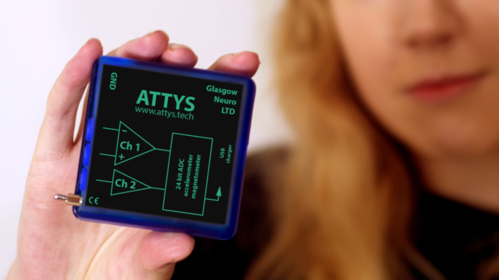

# attys-comm

The C++ API (with Python wrapper) for the Attys bluetooth data acquisition board: http://www.attys.tech

The library is cross platform: It's for Linux and Windows



Please use the pre-compiled packages in particular for Python via pip (compilation especially under
Windows is complicated). See the python section.

## C++ Installation instructions

### Linux

There are pre-compiled packages for Ubuntu LTS:

```
sudo add-apt-repository ppa:berndporr/attys
sudo apt-get update
sudo apt-get install attyscomm-dev
```

or alternatively compile from source:

```
cmake .
make
sudo make install
```

This will generate: a dynamic library libattyscomm*.so and a static
one called libattyscomm_static.a.


### Windows:
Under windows only the static library is generated which
should be used for your code development.
```
cmake -G "Visual Studio 16 2019" -A x64 .
```
and then start Visual C++ and compile it.


## Usage

A small test program is in the `examples` directory which scans
for an Attys and then prints the incoming data to stdout.
Type `cmake .`, `make` and then `./attystest` to run it.

Here is a step by guide how to code it:

1. scan for Attys
```
int ret = attysScan.scan();
```

2. Check the number of Attys detected
```
attysScan.getNAttysDevices()
```

3. If devices have been detected you can get them via
`getAttysComm(0,1,2,etc)`.

4. Set the parameters, for example:
```
attysScan.getAttysComm(0)->setAdc_samplingrate_index(AttysComm::ADC_RATE_250HZ);
```

5. Register a callback
```
attysCallback = new AttysCallback(this);
attysScan.getAttysComm(0)->registerCallback(attysCallback);
```
You need to overload the virtual function of the callback in your program.

6. Start data acquisition
```
attysScan.getAttysComm(0)->start();
```
If you have registered a callback then it's all set!

7. Ending the program:
```
attysScan.getAttysComm(n)->quit();
```

The PDF documentation is in the `doc` folder. The online docs
are here: https://glasgowneuro.github.io/attys-comm/


## Python (SWIG)

Make sure that the C++ library compiles (see above)

This libary is fast and multi threaded. It performs
the data acquisition in the background while python can then
do the postprocessing.

Packages for Linux, Windows and MacOS are on PyPi: https://pypi.org/project/pyattyscomm/

### Linux

#### Python package (pip):

Make sure you have the bluetooth development libraries:
```
sudo apt-get install libbluetooth-dev
```
and then install with:

```
pip3 install pyattyscomm
```

#### From source

You need to have swig-4.x installed. Then run:

```
cmake .
make
make install
./setup.py install
```

and then you can load the module `pyattyscomm` system-wide!


### Windows

#### Python package (pip):

In the python console type:

```
pip install pyattyscomm
```

### From source

Install `swig` and re-run the C++ installation.
Make sure to select "Release" in Visual Studio as python
is usually not installed with its debug libraries.
After compilation you get:

- `Release\_pyattyscomm.exp`
- `Release\_pyattyscomm.pyd`
- `pyattyscomm.py`

Install them with:
```
python setup.py install
```


### How to use

The python API is identical to the C++ one.
All the definitions are in AttysComm.h and AttysScan.h.

Here is an example:

```
# load the module
import pyattyscomm

# Gets the AttysScan class which scans for Attys via bluetooth
s = pyattyscomm.AttysScan()

# Scan for Attys
s.scan()

# get the 1st Attys
c = s.getAttysComm(0)
# if an attys has been found c points to it. Otherwise it's None.

# create a datacallback
class AttysCommCallback(pyattyscomm.SampleCallback):
    def hasSample(self,t,v):
        print(t,v) # so more than just printing!

cb = AttysCommCallback()

pyattyscomm.connectCallback(c,cb)

# Start data acquisition in the background
c.start()

# sleep here or start a GUI

c.quit()
```

### Example programs

Examples programs are in the `examples` folder.

### Documentation

pyattyscomm has in-built extensive documentation. Just do:

```
import pyattyscomm
help(pyattyscomm)
```


Enjoy!

http://www.attys.tech
